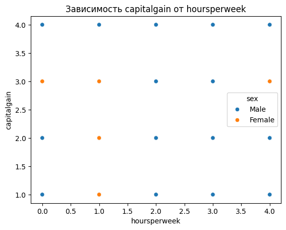
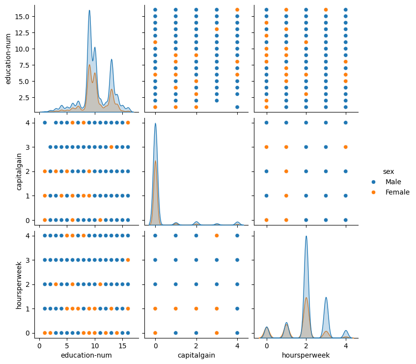
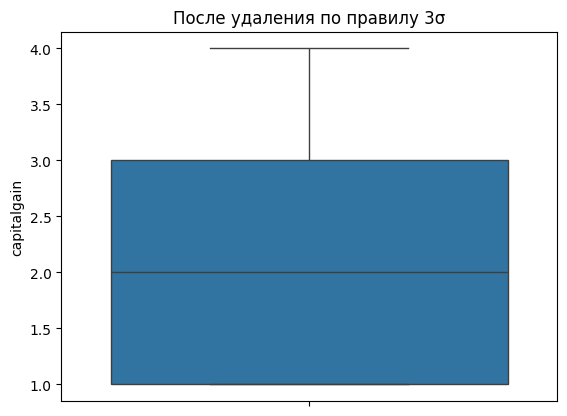

**Цель работы:** Освоение методов визуализации данных, обработки пропущенных значений, выявления и устранения аномалий, а также базовых методов кластеризации с использованием библиотек Seaborn и Scikit-learn.

**Задание:**

1. Построить визуализации распределений и зависимостей между признаками.
2. Обнаружить и обработать пропущенные значения в датасете.
3. Выявить аномалии двумя методами: правилом трёх сигм и методом межквартильного размаха.
4. Выполнить кластеризацию методом KMeans и оценить её качество.

**Ход выполнения:**

### 1. Визуализация данных

Для построения графиков использована библиотека Seaborn. Все графики
сохранены в директорию `lab-02/`.

```python
sns.displot(df["education-num"])
sns.displot(df["education-num"], kind="kde")
```

`displot()` строит гистограмму распределения числового признака.
Параметр `kind='kde'` заменяет столбцы кривой плотности (Kernel
Density Estimate) — сглаженным непрерывным приближением гистограммы.

```python
df_nonzero = df[df["capitalgain"] > 0]
sns.scatterplot(data=df_nonzero, x="hoursperweek", y="capitalgain", hue="sex")
```



Строки с нулевым `capitalgain` отфильтрованы — их включение превратило
бы диаграмму в вертикальную полосу без информативного содержания.
Параметр `hue='sex'` окрашивает точки по значению признака «пол».

```python
sns.countplot(data=df, x="sex")
sns.countplot(data=df, x="sex", hue="marital-status")
```

`countplot()` подсчитывает количество строк для каждого уникального
значения признака. Параметр `hue` разбивает каждый столбец по
дополнительному признаку. Среди мужчин значительно больше состоящих
в браке (`Married-civ-spouse`), среди женщин выше доля `Never-married`
и `Divorced`.

```python
df_pair = df[["education-num", "capitalgain", "hoursperweek", "sex"]]
sns.pairplot(df_pair, hue="sex")
```



`pairplot()` строит матрицу диаграмм рассеяния для каждой пары
признаков. На главной диагонали — кривые плотности. По диагональным
графикам видно, что распределения признаков у мужчин и женщин почти
совпадают.

```
Все графики сохранены.
```

### 2. Обработка пропущенных значений

В Lab 1 было установлено, что три столбца содержат `?`, кодирующий
отсутствующие данные.

```python
for col in ["workclass", "occupation", "native-country"]:
    count = (df[col] == "?").sum()
    print(f"  {col}: {count}")
df_with_na = df.replace("?", pd.NA)
```

```
--- Количество '?' по столбцам ---
  workclass: 2799
  occupation: 2809
  native-country: 857
```

После `replace()` метод `info()` отражает реальное число непустых
значений:

```
 1   workclass       46043 non-null  str
 6   occupation      46033 non-null  str
13   native-country  47985 non-null  str
```

```python
df_dropped = df_with_na.dropna()
```

```
--- После dropna(): осталось строк: 45222 из 48842 ---
```

`dropna()` удаляет все строки с хотя бы одним `NaN` — теряется
3 620 строк (≈7,4%). Строки с пропуском лишь в одном столбце
удаляются целиком.

```python
df_zero = df_with_na.fillna(0)
```

```
--- После fillna(0): пропусков осталось: 0 ---
```

`fillna(0)` заменяет все `NaN` константой. Для категориальных
признаков некорректно: `'0'` не является осмысленным значением
`workclass`.

```python
for col in ["workclass", "occupation", "native-country"]:
    most_frequent = str(df_filled[col].mode()[0])
    df_filled[col] = df_filled[col].fillna(most_frequent)
```

```
  workclass: пропуски заполнены значением 'Private'
  occupation: пропуски заполнены значением 'Prof-specialty'
  native-country: пропуски заполнены значением 'United-States'
--- После заполнения модой: пропусков осталось: 0 ---
```

Заполнение модой — корректная стратегия для категориальных признаков.
`mode()[0]` возвращает наиболее частое значение столбца.

### 3. Выявление и устранение аномалий

Анализ проводился на подмножестве женщин с ненулевым `capitalgain`.

```python
df_fem = df[(df["sex"] == "Female") & (df["capitalgain"] > 0)].copy()
sns.boxplot(data=df_fem, y="capitalgain")
```

```
Женщин с ненулевым capitalgain: 938
```


Прямоугольник охватывает 50% значений (от Q1 до Q3), линия внутри —
медиана, «усы» — допустимый диапазон, точки за усами — выбросы.

```python
m, s = df_fem["capitalgain"].mean(), df_fem["capitalgain"].std()
left_1, right_1 = m - 3 * s, m + 3 * s
df_clean1 = df_fem[(df_fem["capitalgain"] >= left_1) & (df_fem["capitalgain"] <= right_1)]
```

```
Способ 1 — допустимый диапазон: [-1.3; 5.6]
Осталось строк после фильтрации: 938
```



```python
a = df_fem["capitalgain"].quantile(0.25)
b = df_fem["capitalgain"].quantile(0.75)
left_2, right_2 = a - 1.5 * (b - a), b + 1.5 * (b - a)
df_clean2 = df_fem[(df_fem["capitalgain"] >= left_2) & (df_fem["capitalgain"] <= right_2)]
```

```
Способ 2 — 25-я процентиль: 1.0, 75-я процентиль: 3.0
Допустимый диапазон: [-2.0; 6.0]
Осталось строк после фильтрации: 938
```


Оба метода дали одинаковый результат: аномалий не обнаружено.
`capitalgain` закодирован в диапазон 1–4 — выбросы в нём
математически невозможны.

### 4. Кластеризация методом KMeans

```python
model = KMeans(n_clusters=2, random_state=42, n_init=10)
model.fit(df_clust[["education-num", "hoursperweek"]])
df_clust["label"] = model.labels_
```

```
--- Средние значения по полу ---
        education-num  hoursperweek
sex
Female      10.044034      1.646492
Male        10.094977      2.101562

--- Первые строки с меткой кластера ---
   education-num  hoursperweek     sex  label
0             13             2    Male      0
1             13             0    Male      0
2              9             2    Male      1
3              7             2    Male      1
4             13             2  Female      0
```

```python
correct_male   = ((df_clust["sex"] == "Male")   & (df_clust["label"] == male_label)).sum()
correct_female = ((df_clust["sex"] == "Female") & (df_clust["label"] == female_label)).sum()
```

```
Всего мужчин: 32650.  Верно предсказано: 21806.  Ошибочно: 10844.
Всего женщин: 16192.  Верно предсказано:  4928.  Ошибочно: 11264.
Всего верных предсказаний: 26734 из 48842
Точность: 54.7%
```

Точность 54.7% незначительно выше случайного угадывания (50%).
Средние значения признаков у мужчин и женщин почти совпадают
(`education-num`: 10.09 vs 10.04, `hoursperweek`: 2.10 vs 1.65) —
алгоритм разделил выборку по количеству рабочих часов, а не по полу.

**Выводы:**

Освоены ключевые инструменты анализа данных: визуализация (`displot`,
`scatterplot`, `countplot`, `pairplot`), обработка скрытых пропусков
(замена `?` на `NaN` с заполнением модой), выявление аномалий двумя
методами. Кластеризация KMeans показала точность 54.7% — признаки
`education-num` и `hoursperweek` недостаточно разделяют выборку по
полу. Для повышения качества необходимо выбирать признаки с большей
межгрупповой дисперсией.
