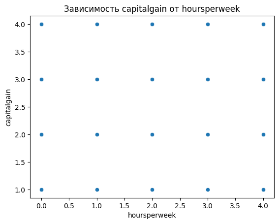
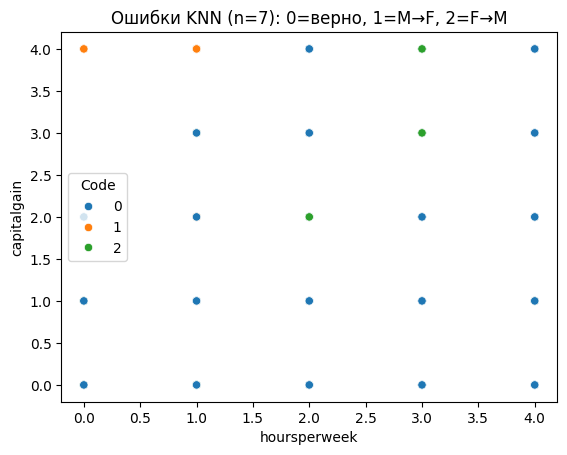
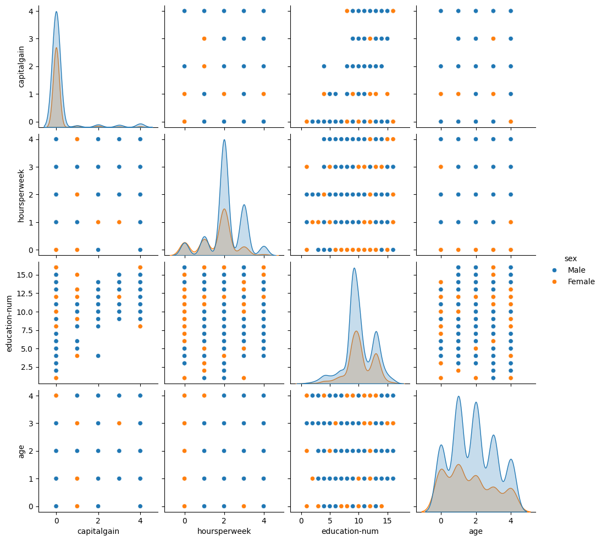

**Цель работы:** Изучение основных методов машинного обучения: линейной и множественной регрессии, метода k ближайших соседей, линейного классификатора и решающих деревьев. Оценка качества моделей с помощью метрик MAE, accuracy, precision и recall.

**Задание:**

1. Построить простую и множественную линейную регрессию для предсказания капитального прироста.
2. Применить метод k ближайших соседей для классификации пола.
3. Применить линейный классификатор (SGDClassifier) и проанализировать его поведение на несбалансированных данных.
4. Построить решающее дерево, сравнить полное дерево и дерево с ограниченной глубиной.

**Ход выполнения:**

### 1. Линейная регрессия

Линейная регрессия ищет коэффициенты уравнения прямой вида
`y = k·x + b`, которое наилучшим образом описывает зависимость
целевого признака от входного. Строки с нулевым `capitalgain`
исключены — эти люди не инвестировали, и их нулевая прибыль
не зависит от признаков.

```python
df1 = df[df["capitalgain"] > 0].copy()
# Строк после фильтрации нулевой прибыли: 4035

X_simple = df1["hoursperweek"].values.reshape(-1, 1)
y = df1["capitalgain"].values
X_train, X_test, y_train, y_test = train_test_split(
    X_simple, y, test_size=0.2, random_state=42
)
model_simple = LinearRegression()
model_simple.fit(X_train, y_train)
```

Метод `reshape(-1, 1)` преобразует одномерный массив `[x1, x2, ...]`
в двумерный `[[x1], [x2], ...]` — именно такой формат требует sklearn
для матрицы признаков X. `train_test_split` делит данные: 80% на
обучение, 20% на проверку.

{ width=80% }

```
Коэффициент k: 0.3184
Свободный член b: 1.7331
Уравнение: capitalgain = 0.32 * hoursperweek + 1.73
MAE на тестовой выборке: 0.9911
```

**Множественная регрессия** использует два признака одновременно:

```python
X_multi = df1[["hoursperweek", "education-num"]].values
model_multi = LinearRegression()
model_multi.fit(X_train_m, y_train_m)
```

```
Коэффициенты: [0.22075645 0.17124476]
Свободный член: 0.0526
Уравнение: capitalgain = 0.22*hoursperweek + 0.17*education-num + 0.05
MAE на тестовой выборке: 0.8751
Улучшение MAE: 0.1160
```

Средняя абсолютная ошибка (MAE) снизилась с 0.9911 до 0.8751 —
добавление второго признака улучшило качество предсказания на 0.116.
Поскольку `capitalgain` закодирован в диапазоне 1–4, MAE ≈ 0.88
означает среднюю ошибку примерно в один шаг шкалы, что соответствует
слабой линейной зависимости между признаками (корреляция
`hoursperweek` и `capitalgain` составила 0.099 в Lab 1).

### 2. Метод k ближайших соседей (kNN)

kNN классифицирует новую точку по большинству голосов среди k
ближайших к ней точек в обучающей выборке. Поскольку алгоритм
использует евклидово расстояние, признаки необходимо нормировать
до единого масштаба.

```python
scaler = StandardScaler()
X_train_scaled = scaler.fit_transform(X_train)
X_test_scaled  = scaler.transform(X_test)
```

`StandardScaler` приводит каждый признак к нулевому среднему и
единичному стандартному отклонению: `x_new = (x − mean) / std`.
Важно: `fit_transform` вызывается только на обучающей выборке,
а `transform` — на тестовой. Обучение scaler на полных данных
привело бы к утечке информации из тестовой выборки.

```
--- Данные после нормирования (первые 3 строки) ---
[[-0.27070992  0.0574821 ]
 [-0.27070992  0.0574821 ]
 [-0.27070992  0.0574821 ]]
```

```python
knn1 = KNeighborsClassifier(n_neighbors=1)
knn1.fit(X_train_scaled, y_train)
```

```
--- KNN (n_neighbors=1) ---
Точность (accuracy): 54.83%
Матрица ошибок:
[[ 304 2929]
 [1484 5052]]
```

При одном соседе модель переобучается на шум отдельных точек.
Увеличение числа соседей до 7 сглаживает решение:

```python
knn7 = KNeighborsClassifier(n_neighbors=7)
```

```
--- KNN (n_neighbors=7) ---
Точность (accuracy): 66.79%
Матрица ошибок:
[[  16 3217]
 [  27 6509]]
```

{ width=80% }

Точность выросла с 54.83% до 66.79%. Матрица ошибок показывает,
что модель почти перестала ошибаться на мужчинах (27 ошибок против
1484), однако теперь хуже распознаёт женщин (3217 ошибок). Это
следствие дисбаланса классов: мужчин в выборке вдвое больше, и
при поиске 7 ближайших соседей большинство из них оказываются
мужчинами.

### 3. Метод линейного классификатора

Линейный классификатор (SGDClassifier) ищет разделяющую гиперплоскость —
прямую в двумерном пространстве признаков, по одну сторону от которой
находятся мужчины, по другую — женщины.

```python
clf = SGDClassifier(random_state=42)
clf.fit(X_train_scaled, y_train)
```

```
--- Линейный классификатор (SGDClassifier) ---
Точность (accuracy): 66.91%
Матрица ошибок:
[[   0 3233]
 [   0 6536]]

--- Метрики по классам ---
  Female: precision=0.000, recall=0.000, f1=0.000, support=3233
  Male:   precision=0.669, recall=1.000, f1=0.802, support=6536
```

Несмотря на accuracy 66.91%, модель полностью провалила предсказание
женщин: все 9769 объектов тестовой выборки классифицированы как
мужчины (recall Female = 0.000). Это классический эффект несбалансированных
классов: SGDClassifier без дополнительной настройки минимизирует
общую ошибку и предсказывает только большинство. Accuracy при этом
выглядит приемлемой (66.9%), но метрики precision и recall
разоблачают реальное положение дел — модель фактически не решила
задачу классификации. Для исправления необходима балансировка классов
или параметр `class_weight='balanced'`.

### 4. Метод решающих деревьев

Решающее дерево последовательно задаёт вопросы вида «признак ≤ порог?»,
каждый раз разбивая выборку на два подмножества. Листья дерева содержат
итоговые классификации. В отличие от kNN и SGD, деревья не требуют
нормирования — они работают с пороговыми значениями, а не с расстояниями.

{ width=80% }

```python
features = ["capitalgain", "hoursperweek", "education-num", "age"]
tree_full = DecisionTreeClassifier(random_state=42)
tree_full.fit(X_train, y_train)
```

```
--- Дерево без ограничения глубины ---
Глубина дерева: 17
Точность (accuracy): 68.11%
Матрица ошибок:
[[ 889 2344]
 [ 771 5765]]
```

Дерево глубиной 17 разбивает данные до мельчайших деталей и
переобучается на обучающей выборке. Структура первых уровней:

```
|--- hoursperweek <= 1.50
|   |--- age <= 3.50
|   |   |--- education-num <= 8.50
|   |   |   |--- class: Male
|   |   |--- education-num >  8.50
|   |   |   |--- class: Female
...
```

Ограничение глубины до 3 — это регуляризация: модель задаёт меньше
вопросов и обобщает лучше:

```python
tree3 = DecisionTreeClassifier(max_depth=3, random_state=42)
```

```
--- Дерево с max_depth=3 ---
Точность (accuracy): 68.52%
Матрица ошибок:
[[ 726 2507]
 [ 568 5968]]

--- Метрики по классам (max_depth=3) ---
  Female: precision=0.561, recall=0.225, f1=0.321, support=3233
  Male:   precision=0.704, recall=0.913, f1=0.795, support=6536
```

Дерево с глубиной 3 показало более высокую точность (68.52% против
68.11%), чем полное дерево. Это подтверждает, что увеличение глубины
не всегда улучшает результат — переобучение снижает качество на
тестовой выборке. Признак `hoursperweek` оказался на вершине дерева —
он наиболее эффективно разделяет выборку. Признак `education-num`
присутствует только в ветви с малым количеством часов работы — при
активной занятости он не является показательным для определения пола.

**Выводы:**

В ходе лабораторной работы реализованы четыре метода машинного
обучения на датасете `learn_dataset.csv`. Линейная регрессия показала,
что слабая корреляция признаков (0.099) ограничивает качество модели
(MAE = 0.88), однако множественная регрессия незначительно улучшает
результат. kNN с n=7 достиг точности 66.79%, продемонстрировав
важность подбора гиперпараметра. SGDClassifier выявил проблему
несбалансированных классов: accuracy 66.91% скрывает полную
неспособность модели распознавать меньший класс. Решающее дерево с
max_depth=3 показало наилучшую точность (68.52%) и подтвердило, что
ограничение глубины предотвращает переобучение. Наиболее
информативным признаком для определения пола оказался `hoursperweek`.
