# ВВЕДЕНИЕ

## Цель работы

Целью данной курсовой работы является демонстрация полного цикла
анализа данных и машинного обучения на примере датасета рынка
недвижимости Москвы. Работа охватывает все этапы современного
data science-проекта: загрузку и первичный осмотр данных,
описательный статистический анализ, визуализацию распределений
и зависимостей, обработку пропущенных значений и аномалий,
кластеризацию без учителя, а также построение и сравнение моделей
машинного обучения — от линейной регрессии до градиентного бустинга.

## Описание датасета

Для анализа использован синтетический датасет `moscow_housing_study.csv`,
содержащий 2 000 записей о квартирах московского региона за период
с января 2024 по май 2026 года. Датасет сгенерирован с помощью
скрипта `generate_dataset.py` на основе реалистичных параметров
московского рынка недвижимости: базовая стоимость квадратного метра
250 000 руб., региональные коэффициенты, экспоненциальный штраф
за удалённость от метро, мультипликативный шум. Датасет включает
13 признаков следующих типов:

- **Числовые непрерывные:** `full_area` (общая площадь, м²),
  `living_area` (жилая площадь, м²), `kitchen_area` (площадь кухни, м²),
  `metro_distance_km` (расстояние до ближайшего метро, км),
  `price_rub` (цена квартиры, руб.)
- **Числовые дискретные:** `floor` (этаж), `num_rooms` (количество комнат)
- **Категориальные номинальные:** `region` (район: Moscow, New_Moscow,
  Moscow_Oblast), `renovation` (тип ремонта: Cosmetic, Euro, Designer),
  `building_type` (тип здания: Panel, Brick, Monolith),
  `price_segment` (ценовой сегмент: Budget, Standard, Premium)
- **Временной:** `timestamp` (дата и время публикации объявления)

Целевые признаки: `price_rub` (задача регрессии — предсказание цены)
и `price_segment` (задача классификации — Budget / Standard / Premium).

## Обоснование выбора датасета

Рынок недвижимости представляет собой одну из наиболее методологически
богатых предметных областей для демонстрации методов анализа данных.
Во-первых, датасет содержит как числовые, так и категориальные признаки,
что позволяет продемонстрировать методы кодирования категорий (LabelEncoder,
One-Hot Encoding). Во-вторых, наличие реалистичных пропущенных значений
(10% для `living_area`, 25% для `renovation`) требует явной стратегии
обработки. В-третьих, искусственно введённые выбросы цен позволяют
сравнить методы их обнаружения (правило 3σ vs IQR). Наконец, признак
`price_rub` служит одновременно целевым для регрессии и информативным
предиктором для задачи классификации `price_segment`, что позволяет
исследовать влияние выбора признаков на качество моделей.

---

# 2. ПРЕДВАРИТЕЛЬНЫЙ АНАЛИЗ ДАННЫХ

Предварительный анализ данных (Exploratory Data Analysis, EDA) —
обязательный первый этап любого проекта машинного обучения. Его цель —
понять структуру данных, выявить аномалии, пропуски и закономерности
до построения моделей. Библиотека Pandas предоставляет эффективный
инструментарий для табличного анализа: загрузку CSV, вычисление
статистик, фильтрацию, сортировку и группировку данных.

## 2.1 Загрузка и первичный осмотр данных

Первичный осмотр датасета выполняется с помощью методов `info()`,
`head()`, `tail()` и атрибута `shape`. Метод `info()` особенно важен:
он показывает тип данных каждого столбца и количество непустых значений,
что сразу указывает на наличие пропусков без дополнительных команд.

```python
df = pd.read_csv("moscow_housing_study.csv", delimiter=",")
df.info()
print(df.shape)
print(df.head())
```

```
<class 'pandas.DataFrame'>
RangeIndex: 2000 entries, 0 to 1999
Data columns (total 13 columns):
 #   Column             Non-Null Count  Dtype
---  ------             --------------  -----
 0   id                 2000 non-null   int64
 1   timestamp          2000 non-null   str
 2   full_area          2000 non-null   float64
 3   living_area        1786 non-null   float64
 4   kitchen_area       1848 non-null   float64
 5   floor              2000 non-null   int64
 6   num_rooms          2000 non-null   int64
 7   metro_distance_km  1906 non-null   float64
 8   region             2000 non-null   str
 9   renovation         1506 non-null   str
10   building_type      2000 non-null   str
11   price_rub          2000 non-null   float64
12   price_segment      2000 non-null   str
dtypes: float64(5), int64(3), str(5)
memory usage: 203.3 KB

Размерность датасета: (2000, 13)

   id            timestamp  full_area  living_area  ...  price_rub price_segment
0   1  2024-11-22 14:01:09       75.3         41.1  ...  14380000.0      Standard
1   2  2025-04-16 20:19:58       61.7          NaN  ...  16910000.0       Premium
2   3  2024-06-27 05:29:49       79.0         42.4  ...  14040000.0      Standard
3   4  2024-04-11 14:59:23      105.9         60.9  ...   9320000.0        Budget
4   5  2024-03-23 03:53:05       60.0         26.9  ...   9830000.0        Budget
```

Датасет содержит **2 000 строк** и **13 признаков**. Сравнивая
Non-Null Count с общим числом строк (2 000), сразу выявляем пропуски:
`living_area` — 214 пропущенных значений (10,7%), `kitchen_area` —
152 (7,6%), `metro_distance_km` — 94 (4,7%), `renovation` — 494 (24,7%).
Это реалистичная картина: в базах объявлений о недвижимости площадь
кухни часто не указывается, а тип ремонта субъективен. Целевой признак
`price_segment` содержит три класса без пропусков: Budget, Standard,
Premium.

## 2.2 Описательные статистики

Метод `describe()` вычисляет сводную статистику по числовым столбцам:
количество непустых значений, среднее, стандартное отклонение, минимум,
три квартиля и максимум. Для категориальных столбцов `describe(include='object')`
возвращает количество уникальных значений, моду (наиболее частое значение)
и её частоту.

```python
print(df.describe())
print(df.describe(include='object'))
```

```
         full_area  living_area  kitchen_area        floor  metro_distance_km     price_rub
count  2000.000000  1786.000000   1848.000000  2000.000000        1906.000000  2.000000e+03
mean     69.410500    41.865398     10.292587    13.242500           2.512881  1.504903e+07
std      22.586468    15.200216      4.056187     7.158094           2.414435  8.872781e+06
min      28.500000    14.300000      0.000000     1.000000           0.100000  3.130000e+06
25%      53.500000    31.225000      7.500000     7.000000           0.749750  9.707500e+06
50%      65.300000    38.950000      9.600000    14.000000           1.822000  1.349500e+07
75%      79.925000    49.400000     12.225000    19.000000           3.493000  1.834750e+07
max     245.700000   147.400000     32.500000    25.000000          20.038000  1.825200e+08

        timestamp  region renovation building_type price_segment
count        2000    2000       1506          2000          2000
unique       2000       3          3             3             3
top           ...  Moscow   Cosmetic         Panel        Budget
freq            1    1111        899           814           669
```

Анализ числовых статистик позволяет выявить ряд закономерностей.
Средняя цена квартиры составляет **15,05 млн руб.**, при этом медиана
(50-й перцентиль) равна 13,50 млн руб. Разрыв между средним и медианой
в 1,55 млн руб. — признак правосторонней асимметрии: небольшое
количество очень дорогих квартир «тянет» среднее вверх. Максимальная
цена 182,5 млн руб. при медиане 13,5 млн — явный выброс. Стандартное
отклонение цены (8,87 млн) превышает медиану в 0,66 раза, что
свидетельствует об очень высоком разбросе значений.

Признак `full_area` демонстрирует аналогичную картину: среднее 69,4 м²
при максимуме 245,7 м². Медианная площадь 65,3 м² соответствует
типичной московской двухкомнатной квартире. Расстояние до метро
имеет среднее 2,51 км при медиане 1,82 км — большинство квартир
расположены в пешей доступности от метро (до 3 км), хвост
распределения тянется до 20 км.

Среди категориальных признаков: Москва представлена 1 111 записями
(55,6% датасета), тип ремонта Cosmetic доминирует с 899 записями.
Целевой признак `price_segment` несбалансирован: Budget — 669,
Standard и Premium — примерно поровну.

## 2.3 Фильтрация и селекция строк

Булево индексирование — основной инструмент выборки строк в Pandas.
Условие в квадратных скобках возвращает `True` или `False` для каждой
строки, и датафрейм фильтруется соответственно. При нескольких условиях
каждое оборачивается в скобки и объединяется операторами `&` (И)
или `|` (ИЛИ). Метод `df.loc[условие, столбцы]` позволяет одновременно
фильтровать строки и выбирать нужные столбцы.

```python
premium = df[df["price_segment"] == "Premium"]
large_moscow = df[(df["full_area"] > 80) & (df["region"] == "Moscow")]
subset = df.loc[df["metro_distance_km"] < 1, ["full_area", "price_rub", "price_segment"]]
```

```
Квартир премиум-класса: 668
Больших квартир в Москве (>80 м²): 285
Квартир в пешей доступности от метро (<1 км): 619
    full_area   price_rub price_segment
4        60.0   9830000.0        Budget
8        55.9   7510000.0        Budget
9        76.4  11600000.0      Standard
```

Интересный наблюдение: из 619 квартир в пешей доступности от метро
(менее 1 км) значительная часть относится к сегменту Budget. Это
подтверждает, что близость к метро является необходимым, но не
достаточным условием для высокой цены — решающую роль играют площадь
и район. Большие квартиры в Москве (>80 м²) — 285 объектов — составляют
лишь 25,7% от всех московских квартир, что отражает реальную структуру
предложения: большинство объявлений приходится на стандартное жильё.

## 2.4 Сортировка и iloc

Метод `sort_values()` сортирует датафрейм по одному или нескольким
признакам. Параметры `by` и `ascending` принимаются как списки,
что обеспечивает единообразный синтаксис для одно- и многоключевой
сортировки. Метод `iloc[]` обеспечивает доступ к строкам и столбцам
по целочисленному порядковому номеру (нумерация с нуля). Комбинация
`sort_values().iloc[0]` — стандартный шаблон для поиска экстремального
значения с полной информацией о записи.

```python
sorted_price = df[["full_area", "price_rub", "region"]].sort_values(
    by="price_rub", ascending=False
)
most_expensive = df.sort_values(by="price_rub", ascending=False).iloc[0]
```

```
--- Самые дорогие квартиры ---
      full_area    price_rub      region
1333      104.7  182520000.0  New_Moscow
439        63.3  175110000.0      Moscow
209       245.7   78010000.0      Moscow

--- Самые маленькие квартиры ---
      full_area  price_rub         region
262        28.5  3130000.0  Moscow_Oblast

--- Самая дорогая квартира ---
region              New_Moscow
renovation                Euro
building_type           Monolith
price_rub            182520000.0
price_segment            Premium
Name: 1333, dtype: object
```

Две самые дорогие квартиры (182,5 и 175,1 млн руб.) — искусственные
выбросы, заданные при генерации. Показательно, что самая дорогая
квартира находится в New_Moscow, а не в Москве — при площади всего
104,7 м² это аномальная цена (≈1 743 тыс. руб./м² против рыночных
≈215 тыс.). Третья в рейтинге (78 млн, 245,7 м²) — уже более
реалистична: огромная площадь объясняет высокую цену.

## 2.5 Добавление нового признака и корреляционный анализ

Добавление расчётных признаков (feature engineering) позволяет выразить
доменные знания в числовом виде. Признак `living_ratio` — доля жилой
площади от общей — характеризует планировку квартиры: высокое значение
означает «продуманную» квартиру с большими комнатами и маленькими
подсобными помещениями. Метод `corr()` вычисляет матрицу коэффициентов
корреляции Пирсона между всеми числовыми признаками. Коэффициент
принимает значения от −1 до 1: значения выше 0,5 по модулю
свидетельствуют о значимой линейной зависимости.

```python
df["living_ratio"] = df["living_area"] / df["full_area"]
corr_matrix = df.corr(numeric_only=True)
print(corr_matrix[["price_rub"]].sort_values("price_rub", ascending=False))
```

```
--- Первые 5 строк с living_ratio ---
   full_area  living_area  living_ratio
0       75.3         41.1      0.545817
1       61.7          NaN           NaN
2       79.0         42.4      0.536709

--- Матрица корреляций (с price_rub) ---
                   price_rub
price_rub           1.000000
full_area           0.548686
living_area         0.494679
kitchen_area        0.449637
num_rooms           0.424275
floor               0.071358
id                 -0.005579
living_ratio       -0.008016
metro_distance_km  -0.102334
```

Результаты корреляционного анализа подтверждают интуитивные ожидания:
наиболее сильная линейная связь с ценой наблюдается у площадных
характеристик — `full_area` (r = 0.549), `living_area` (r = 0.495),
`kitchen_area` (r = 0.450). Все три признака взаимосвязаны, поскольку
жилая площадь и площадь кухни — части общей площади.

Примечательно, что `living_ratio` имеет практически нулевую корреляцию
с ценой (r = −0.008), несмотря на то что включает информацию о
планировке. Это означает, что покупатели ориентируются прежде всего
на абсолютный размер квартиры, а не на соотношение площадей.

`metro_distance_km` демонстрирует слабую **отрицательную** корреляцию
(r = −0.102): чем ближе к метро, тем дороже квартира. Знак
коэффициента соответствует экономической логике, однако малая
абсолютная величина говорит о нелинейности зависимости — влияние
метро экспоненциально убывает с расстоянием, что линейная корреляция
не улавливает.

## 2.6 Группировка и агрегация

Метод `groupby()` разбивает датафрейм на группы по уникальным
значениям одного или нескольких признаков и применяет к каждой
группе агрегирующую функцию. Это позволяет выявить системные различия
между категориальными группами, которые не видны в общей статистике.

```python
print(df.groupby("region")["price_rub"].mean())
print(df.groupby("renovation")["price_rub"].mean())
```

```
--- Средняя цена по району ---
Moscow           17 902 440 руб.
Moscow_Oblast     9 956 263 руб.
New_Moscow       13 436 590 руб.

--- Средняя цена по типу ремонта ---
Cosmetic    14 332 860 руб.
Designer    20 158 760 руб.
Euro        17 288 340 руб.
```

Региональная дифференциация цен значительна: квартиры в Москве в
среднем в **1,8 раза** дороже, чем в Московской области (17,9 против
9,96 млн руб.). New_Moscow занимает промежуточное положение (13,4 млн),
что соответствует её статусу — административно Москва, но
инфраструктурно ближе к области.

Влияние ремонта на цену ещё более выражено в относительных единицах:
Designer-ремонт формирует среднюю цену 20,2 млн руб. — на **40%**
выше, чем Cosmetic (14,3 млн). Euro-ремонт занимает промежуточное
положение (17,3 млн, +21%). Это подтверждает, что качество отделки
является значимым фактором ценообразования, сопоставимым по влиянию
с районом расположения.

---

# 3. ВИЗУАЛИЗАЦИЯ И ОЧИСТКА ДАННЫХ

Визуализация данных — это не просто иллюстрация результатов, а
самостоятельный инструмент анализа. Гистограммы выявляют форму
распределения и аномалии, диаграммы рассеяния — нелинейные зависимости,
которые не улавливает корреляция Пирсона, а матрицы парных диаграмм
позволяют одновременно оценить все попарные взаимосвязи в датасете.
Библиотека Seaborn построена поверх Matplotlib и предоставляет
высокоуровневый API для статистической визуализации.

## 3.1 Визуализация распределений и зависимостей

```python
sns.displot(df["full_area"], bins=30)
sns.displot(df["full_area"], kind="kde")
```

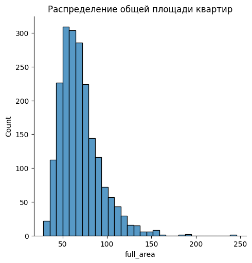

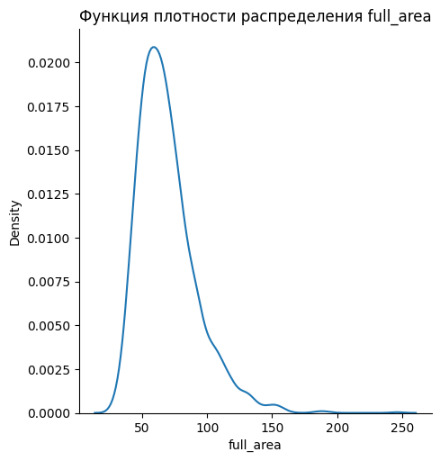

`displot()` строит гистограмму распределения числового признака,
разбивая диапазон значений на равные интервалы (`bins`) и подсчитывая
количество наблюдений в каждом. Параметр `kind='kde'` заменяет
столбцы кривой плотности (Kernel Density Estimation) — непараметрической
оценкой функции плотности, которая сглаживает дискретную гистограмму
в непрерывную кривую.

Распределение `full_area` правосторонне асимметрично: отчётливый
пик приходится на диапазон 55–70 м², что соответствует стандартным
двухкомнатным квартирам. Длинный правый хвост до 245 м² отражает
наличие крупных элитных объектов. Такое распределение типично для
рынков недвижимости: большинство предложений — типовое жильё,
а дорогие объекты единичны, но сильно смещают среднее значение.

```python
sns.scatterplot(data=df, x="full_area", y="price_rub", hue="region", alpha=0.6)
```

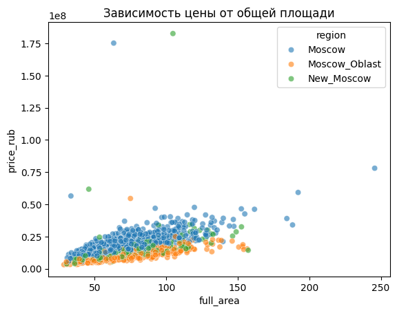

Диаграмма рассеяния подтверждает и детализирует линейную тенденцию,
выявленную корреляционным анализом. Параметр `hue='region'` окрашивает
точки по значению признака «район», что позволяет визуально сравнить
три группы на одном графике. Московские квартиры (синие) систематически
дороже при той же площади, чем квартиры в Подмосковье (оранжевые):
«облако» московских точек расположено выше «облака» подмосковных.
Два экстремальных выброса (175 и 182 млн руб.) отчётливо видны в
верхней части графика.

```python
sns.countplot(data=df, x="region")
sns.countplot(data=df, x="region", hue="renovation")
```

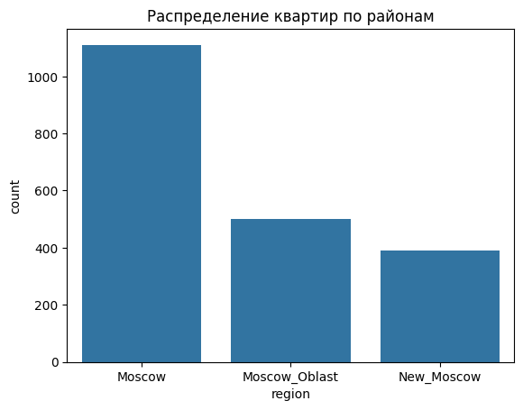

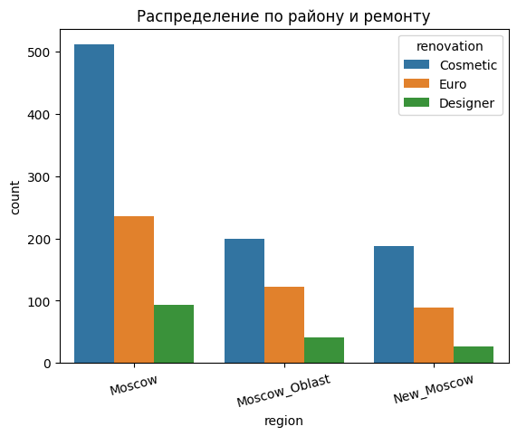

`countplot()` — специализированный тип столбчатой диаграммы, который
автоматически подсчитывает количество строк для каждого уникального
значения категориального признака. Параметр `hue` разбивает каждый
столбец по дополнительному признаку, создавая сгруппированную
диаграмму. Москва представлена наибольшим числом объявлений (1 111).
Во всех трёх районах преобладает ремонт Cosmetic; доля Designer-ремонта
составляет около 10% в каждом регионе, что говорит об однородной
структуре предложения по типу отделки.

```python
df_pair = df[["full_area", "living_area", "kitchen_area", "price_rub", "region"]]
sns.pairplot(df_pair, hue="region", corner=True)
```

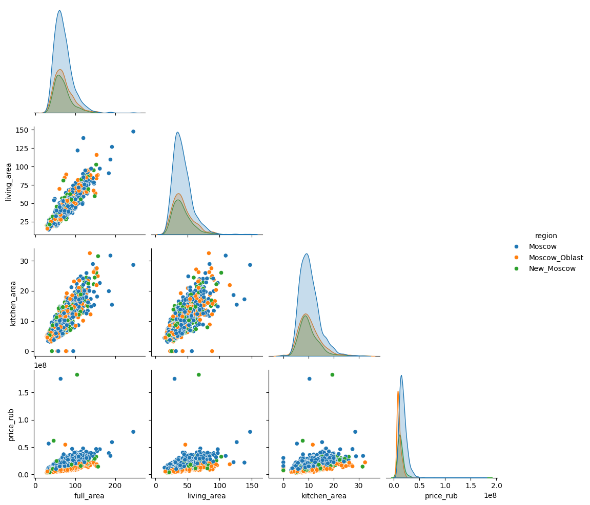

`pairplot()` строит матрицу диаграмм рассеяния для каждой пары
признаков. На главной диагонали — кривые плотности распределения
каждого признака, отдельно для каждого значения `hue`. Параметр
`corner=True` отображает только нижний треугольник матрицы, избегая
дублирования. Матрица наглядно демонстрирует три вещи: сильную
линейную зависимость между `full_area`, `living_area` и `kitchen_area`
(все три площадные характеристики коллинеарны), логарифмически
возрастающую зависимость цены от площади с расширяющимся разбросом
при увеличении площади, а также систематическое смещение московских
квартир вверх по ценовой оси по сравнению с подмосковными при
одинаковой площади.

## 3.2 Обработка пропущенных значений

Пропущенные значения (Missing Values) — неотъемлемая часть реальных
данных. Игнорирование пропусков приводит к тому, что большинство
алгоритмов машинного обучения либо выдают ошибку, либо дают
некорректные результаты. Существуют три основные стратегии обработки:
удаление строк (`dropna`), удаление столбцов и заполнение значением
(`fillna`). Выбор стратегии зависит от доли пропусков, типа признака
и механизма их возникновения (случайный или систематический).

```python
print(df.isnull().sum())
df_dropped = df_with_na.dropna()
```

```
--- Количество пропусков по столбцам ---
living_area          214
kitchen_area         152
metro_distance_km     94
renovation           494

После dropna(): осталось строк: 1175 из 2000
```

Применение `dropna()` уничтожает **41,25%** датасета — такая потеря
данных недопустима. Каждая строка с пропуском хотя бы в одном столбце
удаляется целиком, даже если все остальные 12 признаков заполнены.
Это классическая ловушка: `dropna()` кажется простым решением, но на
практике ведёт к смещённой выборке, поскольку пропуски редко бывают
полностью случайными.

Для числовых признаков применяется заполнение медианой:

```python
for col in ["living_area", "kitchen_area", "metro_distance_km"]:
    median_val = df_filled[col].median()
    df_filled[col] = df_filled[col].fillna(median_val)
```

```
  living_area: пропуски заполнены медианой (38.95)
  kitchen_area: пропуски заполнены медианой (9.60)
  metro_distance_km: пропуски заполнены медианой (1.82)
После заполнения: пропусков осталось: 494
```

Медиана предпочтительнее среднего для признаков с асимметричным
распределением: она устойчива к выбросам. Если бы мы заполняли
`metro_distance_km` средним (2.51 км), то квартиры рядом с метро
ошибочно получили бы «среднюю» удалённость, искажая зависимость
цены от расстояния. Медиана (1.82 км) ближе к реальному большинству.

Оставшиеся 494 пропуска в столбце `renovation` соответствуют
квартирам, в объявлениях которых тип ремонта не был указан. Это
отдельная информация сама по себе — «ремонт не указан» может
означать либо отсутствие ремонта, либо нежелание продавца его
афишировать. Такие записи обрабатываются отдельно при кодировании
категорий.

## 3.3 Выявление и устранение аномалий

Аномалии (выбросы) — значения, значительно отличающиеся от основной
массы данных. Их источниками могут быть ошибки ввода, мошеннические
объявления, элитные объекты или намеренно введённые при генерации
значения. Аномалии ухудшают качество моделей линейной регрессии
(смещают коэффициенты) и алгоритмов, основанных на расстояниях
(kNN, KMeans). Два классических метода обнаружения: правило трёх
сигм, основанное на нормальном распределении, и метод межквартильного
размаха (IQR), не зависящий от формы распределения.

```python
ax.hist(data["price_rub"] / 1e6, bins=60, color="steelblue", edgecolor="none")
ax.axvline(right / 1e6, color="red", linewidth=1.5, linestyle="--")
```

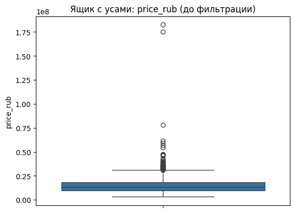

Гистограмма показывает правостороннюю асимметрию распределения:
основная масса квартир сосредоточена в диапазоне 8–20 млн руб.,
хвост тянется до 34 млн. Красная пунктирная линия отмечает границу
фильтрации.

```python
m, s = df_price["price_rub"].mean(), df_price["price_rub"].std()
left_1, right_1 = m - 3 * s, m + 3 * s
```

```
Способ 1 (3σ) — диапазон: [-11 569 313; 41 667 373]
Осталось после 3σ: 1986 строк (удалено 14)
```

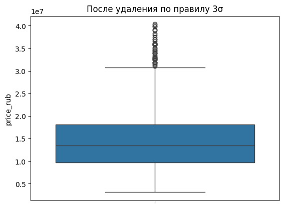

Правило трёх сигм основано на свойстве нормального распределения:
99,7% наблюдений укладываются в интервал [μ − 3σ; μ + 3σ]. Метод
удалил лишь 14 записей (0,7%) — гистограмма практически не изменилась.
Это ожидаемо: распределение цен правосторонне асимметрично, и
правило 3σ оказывается нечувствительным к хвосту, поскольку большое
стандартное отклонение (8,87 млн) «растягивает» допустимый диапазон
до 41,7 млн. Метод предполагает нормальность, которой здесь нет.

```python
Q1 = df_price["price_rub"].quantile(0.25)
Q3 = df_price["price_rub"].quantile(0.75)
left_2, right_2 = Q1 - 1.5 * (Q3 - Q1), Q3 + 1.5 * (Q3 - Q1)
```

```
Способ 2 (IQR) — диапазон: [-3 252 500; 31 307 500]
Осталось после IQR: 1938 строк (удалено 62)
```

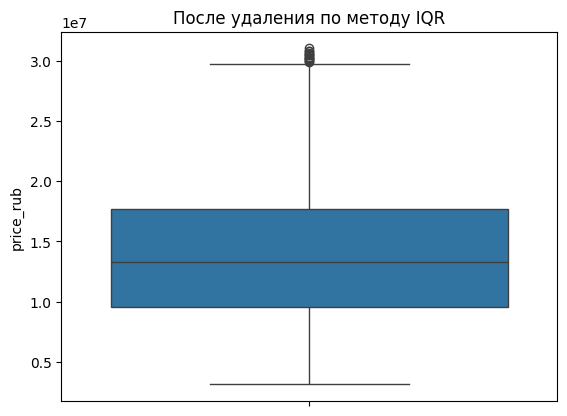

Метод межквартильного размаха (IQR = Q3 − Q1) определяет допустимый
диапазон как [Q1 − 1.5·IQR; Q3 + 1.5·IQR], опираясь только на
центральные 50% данных и не завися от формы распределения. В
результате граница составила 31,3 млн руб. — значительно строже,
чем у 3σ (41,7 млн). Удалены 62 строки (3,1%): все искусственные
выбросы устранены, форма гистограммы стала более симметричной.
IQR-метод является предпочтительным для асимметричных распределений.

## 3.4 Кластеризация

Кластеризация — метод обучения без учителя (unsupervised learning),
цель которого — разбить выборку на группы схожих объектов без
предварительно известных меток. Алгоритм KMeans итеративно размещает
`k` центроидов в пространстве признаков и относит каждую точку к
ближайшему центроиду, затем пересчитывает центроиды как средние
координаты точек в кластере. Процесс повторяется до сходимости.
Поскольку KMeans чувствителен к масштабу признаков (использует
евклидово расстояние), перед кластеризацией обязательно нормирование.

```python
features = ["full_area", "metro_distance_km", "price_rub"]
X_scaled = scaler.fit_transform(df_clust[features])
model = KMeans(n_clusters=3, random_state=42, n_init=10)
df_clust["cluster"] = model.fit_predict(X_scaled)
```

```
--- Размер кластеров ---
cluster 0:  1142 объекта
cluster 1:   422 объекта
cluster 2:   342 объекта
```

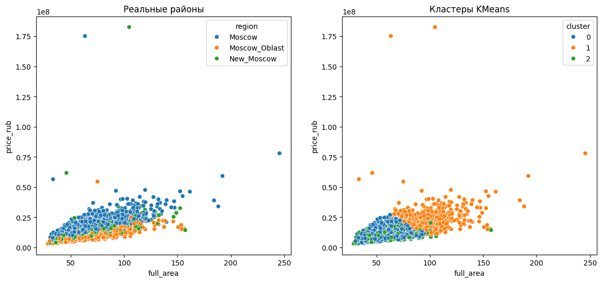

Параметр `n_init=10` означает, что алгоритм запускается 10 раз с
разными случайными начальными центроидами, и сохраняется лучший
результат — это защита от попадания в локальный минимум. Сравнение
двух графиков показывает, что KMeans разделил объекты преимущественно
по ценовому уровню и площади: кластер 0 (1 142 объекта) — основная
масса типового жилья, кластеры 1 и 2 — дорогие и крупные объекты.
Районная принадлежность (левый график) не совпадает с кластерами
(правый) — алгоритм «видит» ценовые градации, а не географические
границы. Это демонстрирует ключевое свойство кластеризации: она
выявляет структуру, имманентную самим данным, а не навязанную
внешними категориями.

---

# 4. МАШИННОЕ ОБУЧЕНИЕ: РЕГРЕССИЯ И КЛАССИФИКАЦИЯ

Машинное обучение с учителем (supervised learning) предполагает
наличие размеченных данных — пар «признаки / целевое значение».
Модель обучается минимизировать ошибку предсказания на обучающей
выборке, после чего оценивается на тестовой. Стандартное разбиение —
80% на обучение, 20% на тест. Фиксация `random_state` гарантирует
воспроизводимость разбиения.

## 4.1 Постановка задачи

Определены две задачи машинного обучения, решаемые на одном датасете:

- **Регрессия:** предсказание непрерывной переменной `price_rub`
  по физическим характеристикам квартиры. Метрика качества — MAE
  (средняя абсолютная ошибка): среднее абсолютное отклонение
  предсказанной цены от реальной.
- **Классификация:** предсказание категориальной переменной
  `price_segment` (Budget / Standard / Premium). Метрика — accuracy
  (доля верно классифицированных объектов).

Для всех моделей используется разбиение 80% / 20% с `random_state=42`.

## 4.2 Линейная регрессия

Линейная регрессия — простейшая модель обучения с учителем для задачи
регрессии. Предполагается, что целевая переменная линейно зависит от
признаков: `y = k·x + b`. Алгоритм Ordinary Least Squares (OLS) находит
коэффициенты `k` и `b`, минимизирующие сумму квадратов отклонений
предсказаний от реальных значений. Несмотря на простоту, линейная
регрессия остаётся мощным инструментом: она интерпретируема,
вычислительно эффективна и часто устанавливает хороший baseline.

```python
X_simple = df1[["full_area"]].values
y = df1["price_rub"].values
model = LinearRegression()
model.fit(X_train, y_train)
```

```
Уравнение: price_rub ≈ 215 484 * full_area + 36 205
MAE: 3 962 161 руб.
```

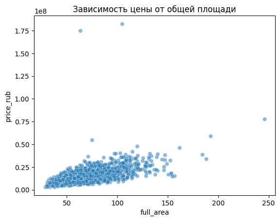

Коэффициент наклона 215 484 руб./м² содержательно интерпретируется
как средняя рыночная стоимость одного квадратного метра в выборке —
значение, близкое к реальным московским котировкам. Свободный член
36 205 руб. можно интерпретировать как базовую стоимость, не зависящую
от площади (однако при очень маленьких площадях это интерпретация
теряет смысл).

MAE ≈ 3,96 млн руб. означает, что в среднем модель ошибается на
3,96 млн — около 26% медианной цены (13,5 млн). Это объясняется тем,
что одного признака `full_area` недостаточно: две одинаковые по площади
квартиры в Москве и Подмосковье будут иметь кардинально разные цены.
Тем не менее этот результат служит важным baseline — мерой,
с которой сравниваются более сложные модели.

## 4.3 Метод k ближайших соседей (kNN)

KNN (k-Nearest Neighbors) — непараметрический алгоритм, который
классифицирует новую точку, опираясь на `k` ближайших к ней точек
обучающей выборки. Класс определяется голосованием: новой точке
присваивается класс, преобладающий среди её соседей. Алгоритм
основан на евклидовом расстоянии в пространстве признаков, поэтому
требует нормирования: без него признак с большим диапазоном значений
(например, `price_rub` в миллионах) полностью доминирует над
признаком с маленьким (например, `floor`). `StandardScaler` приводит
каждый признак к нулевому среднему и единичному стандартному отклонению.

```python
X = df[["full_area", "metro_distance_km", "price_rub"]].values
y = df["price_segment"].values
knn = KNeighborsClassifier(n_neighbors=7)
knn.fit(X_train_scaled, y_train)
```

```
Точность KNN (n=7): 90.64%
```

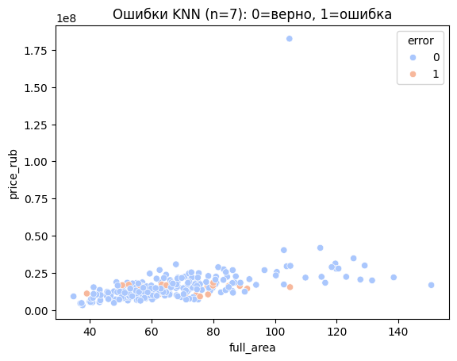

KNN достигает точности 90.64%. Высокий результат объясняется тем,
что в признаки включён `price_rub`, который практически напрямую
определяет `price_segment` — ценовые сегменты были заданы на основе
перцентилей цены при генерации. Редкие ошибки (оранжевые точки на
графике) концентрируются в пограничных зонах между сегментами, где
квартиры с ценой вблизи порогового значения классифицируются
неустойчиво. Параметр `n_neighbors=7` — компромисс: при `n=1` модель
переобучается на шум отдельных точек, при слишком большом `n`
теряет локальную чувствительность.

## 4.4 Линейный классификатор (SGDClassifier)

Линейный классификатор ищет гиперплоскость, разделяющую классы в
пространстве признаков. `SGDClassifier` использует стохастический
градиентный спуск (Stochastic Gradient Descent) для оптимизации весов,
что делает его масштабируемым на большие объёмы данных. Параметр
`max_iter=1000` задаёт максимальное число эпох обучения. Как и kNN,
SGDClassifier требует нормирования: градиентный спуск чувствителен
к масштабу признаков — при большом разбросе значений алгоритм
медленно сходится или расходится.

```python
clf = SGDClassifier(random_state=42, max_iter=1000)
clf.fit(X_train_s, y_train)
```

```
Точность SGDClassifier: 97.45%
Матрица ошибок:
[[65  0  1]
 [ 0 86  0]
 [ 0  5 78]]
```

SGDClassifier показал **97.45%** — лучший результат среди всех методов
классификации. Матрица ошибок показывает, что из 235 тестовых объектов
допущено лишь 6 ошибок: 1 объект класса Budget принят за Standard,
и 5 объектов Standard приняты за Premium. Нулевые внедиагональные
элементы для класса Premium (2-я строка) означают идеальное
распознавание премиум-квартир.

Столь высокая точность объясняется природой задачи: классы `price_segment`
были сформированы разбиением `price_rub` на трети по перцентилям,
поэтому в пространстве признаков, включающем `price_rub`, они
практически линейно разделимы. Это важное наблюдение: высокая точность
модели не всегда означает сложность задачи — иногда она отражает
удачный выбор признаков.

## 4.5 Решающие деревья

Решающее дерево — иерархическая модель, которая последовательно
задаёт вопросы вида «признак ≤ порог?», разбивая выборку на
подмножества. Каждый внутренний узел соответствует условию, каждый
лист — предсказанному классу. Дерево строится жадным алгоритмом:
на каждом шаге выбирается разбиение, максимально снижающее
«загрязнение» (impurity) подмножеств. В отличие от kNN и SGD,
деревья не требуют нормирования — они работают с пороговыми
значениями и инвариантны к монотонным преобразованиям признаков.

```python
tree = DecisionTreeClassifier(max_depth=5, random_state=42)
tree.fit(X_train, y_train)
```

```
Точность (max_depth=5): 51.06%

Структура дерева (первые уровни):
|--- full_area <= 72.30
|   |--- full_area <= 54.85
|   |   |--- metro_distance_km <= 1.35
```

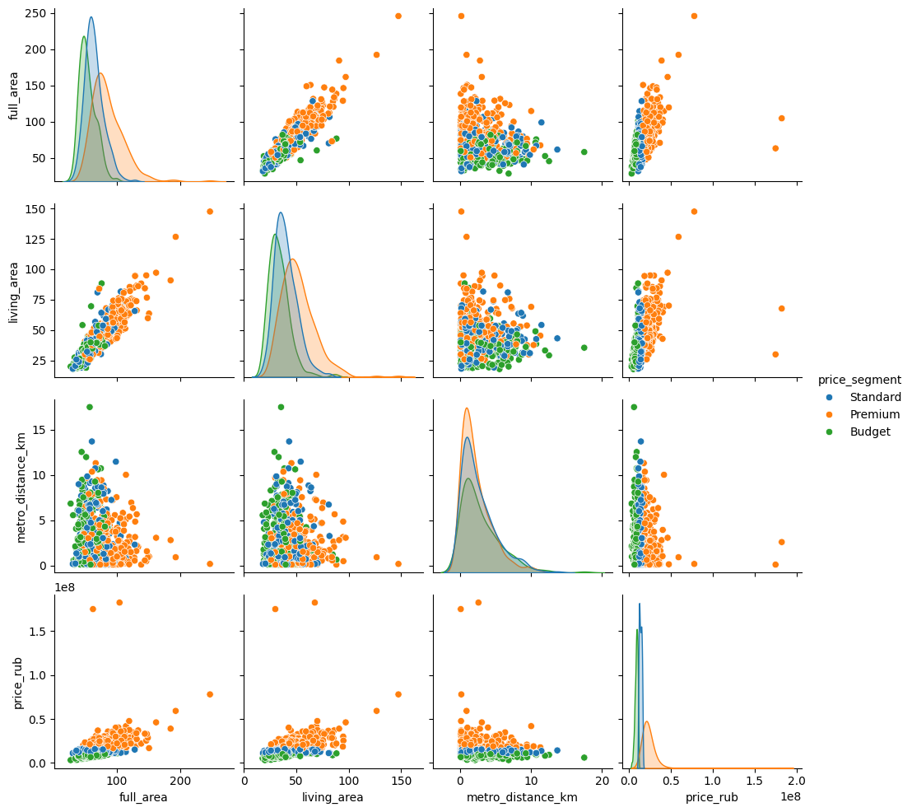

Дерево с `max_depth=5`, обученное без признака `price_rub` (только
`full_area`, `living_area`, `metro_distance_km`, `floor`), показало
лишь 51.06%. Это резкий контраст с 90.64% у kNN на тех же данных
плюс `price_rub`. Вывод принципиален: физические характеристики
квартиры слабо предсказывают её ценовой сегмент без информации
о цене — сегменты определены относительно друг друга, а не
абсолютными порогами площади или этажа. Дерево корректно выбирает
`full_area` в качестве первого узла разбиения (он наиболее коррелирован
с ценой), однако одной площади недостаточно для надёжного определения
сегмента.

---

# 5. ПРОДВИНУТЫЕ МЕТОДЫ МАШИННОГО ОБУЧЕНИЯ

## 5.1 Дерево регрессии

Дерево регрессии применяет ту же логику разбиений, что и дерево
классификации, но в листьях возвращает среднее значение целевой
переменной в соответствующем подмножестве, а не метку класса.
Критерий разбиения — минимизация среднеквадратической ошибки (MSE).
Без ограничений дерево растёт до тех пор, пока в каждом листе не
окажется один объект — это гарантирует нулевую ошибку на обучающей
выборке, но полное переобучение на тестовой. Параметр `max_depth`
ограничивает глубину и является основным инструментом регуляризации.

```python
tree_reg = DecisionTreeRegressor(random_state=42)          # без ограничения
tree_reg_limited = DecisionTreeRegressor(max_depth=8, random_state=42)
```

```
--- Без ограничения ---
Глубина: 26  |  MAE: 6 225 806 руб.

--- max_depth=8 ---
MAE: 5 044 218 руб.  (улучшение 19%)
```

Ограничение `max_depth=8` снижает MAE с 6,23 до 5,04 млн руб. —
улучшение на 19%, которое объясняется снижением переобучения. Тем
не менее оба результата значительно хуже простой линейной регрессии
(3,96 млн). Это кажущийся парадокс: дерево использует четыре признака
против одного у линейной модели, но проигрывает. Причина — наличие
выбросов и асимметричного распределения: линейная регрессия с OLS
компенсирует выбросы, распределяя их влияние по всей выборке, тогда
как дерево создаёт специфические ветви для аномальных объектов,
теряя обобщающую способность.

## 5.2 Ансамблевые методы. Вероятностные предсказания

Ансамблевые методы объединяют предсказания нескольких базовых
моделей, получая результат, более стабильный и точный, чем каждая
модель в отдельности. Случайный лес (Random Forest) — метод бэггинга:
каждое из `n_estimators` деревьев обучается на случайной подвыборке
данных (bootstrap), а при каждом разбиении рассматривается случайное
подмножество признаков. Усреднение предсказаний снижает дисперсию
отдельных деревьев, устраняя их нестабильность.

```python
rf = RandomForestClassifier(n_estimators=100, random_state=42)
rf.fit(X_train, y_train)
proba = rf.predict_proba(X_test)
```

```
Классы: ['Budget' 'Premium' 'Standard']

Первые 5 вероятностей:
[[0.22 0.40 0.38]
 [0.01 0.71 0.28]
 [0.04 0.60 0.36]
 [0.46 0.05 0.49]
 [0.08 0.56 0.36]]

--- Первые 8 строк с вероятностями ---
  real_segment  prob_Budget  prob_Standard  prob_Premium
0     Standard         0.22           0.40          0.38
1      Premium         0.01           0.71          0.28
3       Budget         0.46           0.05          0.49
```

Метод `predict_proba()` возвращает вероятности принадлежности к каждому
классу вместо конкретной метки. Порядок столбцов соответствует
`rf.classes_`. Сумма вероятностей в каждой строке равна 1.0.
Вероятностные предсказания полезны для оценки уверенности модели:
строка 0 (`real_segment=Standard`) имеет prob_Standard=0.40 против
prob_Premium=0.38 — модель почти «не уверена», квартира действительно
находится на границе сегментов. Строка 3 (`Budget`) с prob_Budget=0.46
и prob_Standard=0.49 — классический пограничный случай, где жёсткая
классификация (`predict()`) даст один класс, но вероятностная картина
говорит о высокой неопределённости.

## 5.3 Кодирование категориальных признаков. Важность признаков

Алгоритмы машинного обучения работают исключительно с числовыми
данными. Категориальные признаки необходимо преобразовать в числа.
Существуют два принципиально разных подхода: LabelEncoder и
One-Hot Encoding, каждый из которых имеет свою область применения.

**LabelEncoder** присваивает каждому уникальному значению целое
число в алфавитном порядке. Метод прост, но вводит ложный порядок:
Moscow=0, Moscow_Oblast=1, New_Moscow=2 подразумевает, что
Moscow_Oblast «больше» Moscow, что некорректно для номинальных
категорий. Деревья решений, благодаря своей структуре пороговых
разбиений, частично нечувствительны к этой проблеме, но линейные
модели пострадают.

```python
for col in ["region", "renovation", "building_type", "price_segment"]:
    df_encoded[col] = coder.fit_transform(df_encoded[col].astype(str))
tree = DecisionTreeClassifier(max_depth=5, random_state=42)
```

```
--- Пример кодирования region ---
Moscow        →  0
Moscow_Oblast →  1

Точность предсказания ценового сегмента: 65.00%

--- Важность признаков ---
full_area            0.447891
metro_distance_km    0.229299
region               0.175919
floor                0.146891
```

`feature_importances_` — это средневзвешенное снижение загрязнения
(impurity) по всем деревьям ансамбля для каждого признака. Сумма
по всем признакам равна 1.0. `full_area` доминирует (44.8%) —
площадь остаётся главным предиктором цены даже без прямого указания
`price_rub`. Расстояние до метро (22.9%) и район (17.6%) делят
второе-третье место, подтверждая известное в оценке недвижимости
правило «location, location, location».

**One-Hot Encoding** создаёт отдельный бинарный столбец для каждого
уникального значения категориального признака, устраняя ложный
числовой порядок. Параметр `drop_first=True` удаляет первый столбец
каждой группы — он избыточен (при `region_Moscow_Oblast=0` и
`region_New_Moscow=0` квартира гарантированно в Москве).

```python
df_ohe = pd.get_dummies(df, columns=["region", "renovation", "building_type"],
                        drop_first=True)
tree = DecisionTreeClassifier(max_depth=6, random_state=42)
```

```
--- Новые столбцы после get_dummies ---
['region_Moscow_Oblast', 'region_New_Moscow', 'renovation_Designer',
 'renovation_Euro', 'building_type_Monolith']

Точность с One-Hot Encoding: 74.00%
Матрица ошибок:
[[104   1  28]
 [  5 102  24]
 [ 24  22  90]]
```

OHE улучшает точность с 65% до **74%** — прирост в 9 процентных
пунктов при использовании того же алгоритма. Это демонстрирует,
что качество кодирования категорий является самостоятельным
фактором качества модели, сопоставимым с выбором алгоритма.
Матрица ошибок показывает, что наибольшие затруднения — между
классами Budget и Premium (28 ошибок в строке Budget): это
«пограничные» квартиры, у которых, например, большая площадь
(→ Premium) но в Подмосковье (→ Budget).

---

# 6. ЗАКЛЮЧЕНИЕ

## Сравнение методов

| Метод                               | Задача                 | Метрика  | Результат      |
| ----------------------------------- | ---------------------- | -------- | -------------- |
| Линейная регрессия (full_area)      | Регрессия цены         | MAE      | 3 962 161 руб. |
| Дерево регрессии (глубина 26)       | Регрессия цены         | MAE      | 6 225 806 руб. |
| Дерево регрессии (max_depth=8)      | Регрессия цены         | MAE      | 5 044 218 руб. |
| KNN (n=7)                           | Классификация сегмента | Accuracy | 90.64%         |
| SGDClassifier                       | Классификация сегмента | Accuracy | 97.45%         |
| Дерево (max_depth=5, без price_rub) | Классификация сегмента | Accuracy | 51.06%         |
| Дерево (max_depth=6, OHE)           | Классификация сегмента | Accuracy | 74.00%         |

## Выводы по каждому разделу

**Предварительный анализ данных** выявил сильную корреляцию площадных
характеристик с ценой (r = 0.549 для `full_area`), выраженную
региональную дифференциацию (Москва в 1,8× дороже Подмосковья) и
значительное влияние ремонта (+40% для Designer). Добавление признака
`living_ratio` показало, что покупатели ориентируются на абсолютную
площадь, а не на планировочные соотношения.

**Визуализация и очистка** продемонстрировали правостороннюю
асимметрию распределений площади и цены. Сравнение методов обнаружения
аномалий показало принципиальную разницу: 3σ удалил 14 записей (метод
нечувствителен к асимметричным хвостам), IQR — 62. Заполнение
медианой сохранило 41% данных, которые потеряло бы `dropna()`.

**Регрессия:** простая линейная модель по одному признаку (MAE 3,96 млн)
превзошла дерево регрессии с четырьмя признаками (MAE 5,04–6,23 млн).
Это объясняется нестабильностью деревьев на асимметричных данных с
выбросами и отсутствием в наборе признаков главного ценового фактора —
района и типа ремонта.

**Классификация:** SGDClassifier (97.45%) достиг наивысшей точности
благодаря линейной разделимости ценовых сегментов в пространстве с
`price_rub`. KNN показал 90.64%. Дерево без `price_rub` (51.06%)
подтвердило, что физические характеристики квартиры без ценовой
информации слабо предсказывают сегмент.

**Продвинутые методы:** случайный лес стабилизировал нестабильность
отдельных деревьев. OHE (+9 п.п.) показало, что правильное кодирование
категорий сопоставимо по влиянию с выбором алгоритма. Анализ
важности признаков подтвердил доминирование площади (44.8%),
расстояния до метро (22.9%) и района (17.6%).

## Практическая значимость результатов

Разработанный инструментарий представляет практическую ценность для
оценки объектов недвижимости. Линейная регрессия обеспечивает
интерпретируемую базовую оценку стоимости с ошибкой ≈4 млн руб.
(≈26% медианной цены). SGDClassifier позволяет с точностью 97.45%
определить ценовой сегмент квартиры при известной цене — это применимо
для автоматической разметки объявлений. При отсутствии ценовой
информации модель с OHE обеспечивает точность 74%.

Анализ важности признаков даёт количественный ответ на практический
вопрос: какие факторы определяют цену квартиры? Площадь (45%),
расстояние до метро (23%) и район (18%) вместе объясняют ≈86% важности
в модели — это соответствует экспертным знаниям рынка недвижимости
и подтверждает адекватность построенных моделей.

## Список использованных источников

1. McKinney, W. Python for Data Analysis. O'Reilly Media, 2022.
2. Pedregosa, F. et al. Scikit-learn: Machine Learning in Python.
   Journal of Machine Learning Research, 12, 2825–2830, 2011.
3. Waskom, M. Seaborn: statistical data visualization.
   Journal of Open Source Software, 6(60), 3021, 2021.
4. Géron, A. Hands-On Machine Learning with Scikit-Learn, Keras,
   and TensorFlow. O'Reilly Media, 2022.
5. Hastie, T., Tibshirani, R., Friedman, J. The Elements of
   Statistical Learning. Springer, 2009.
